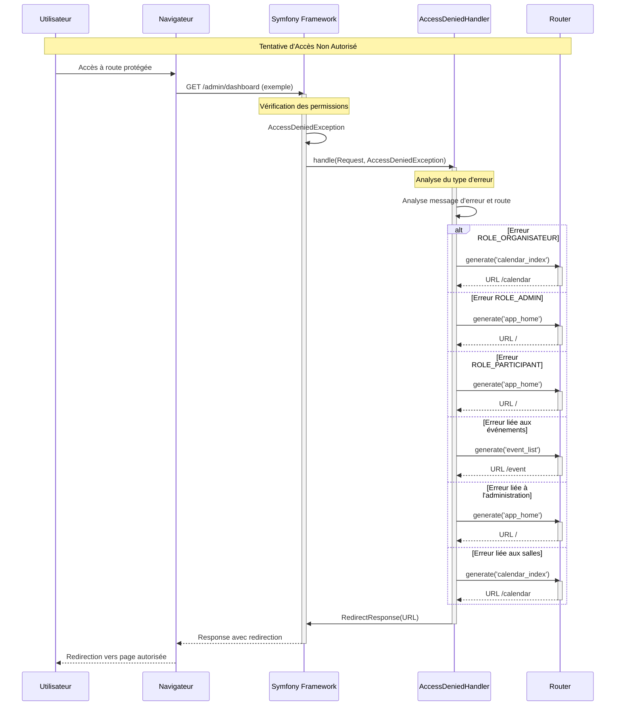
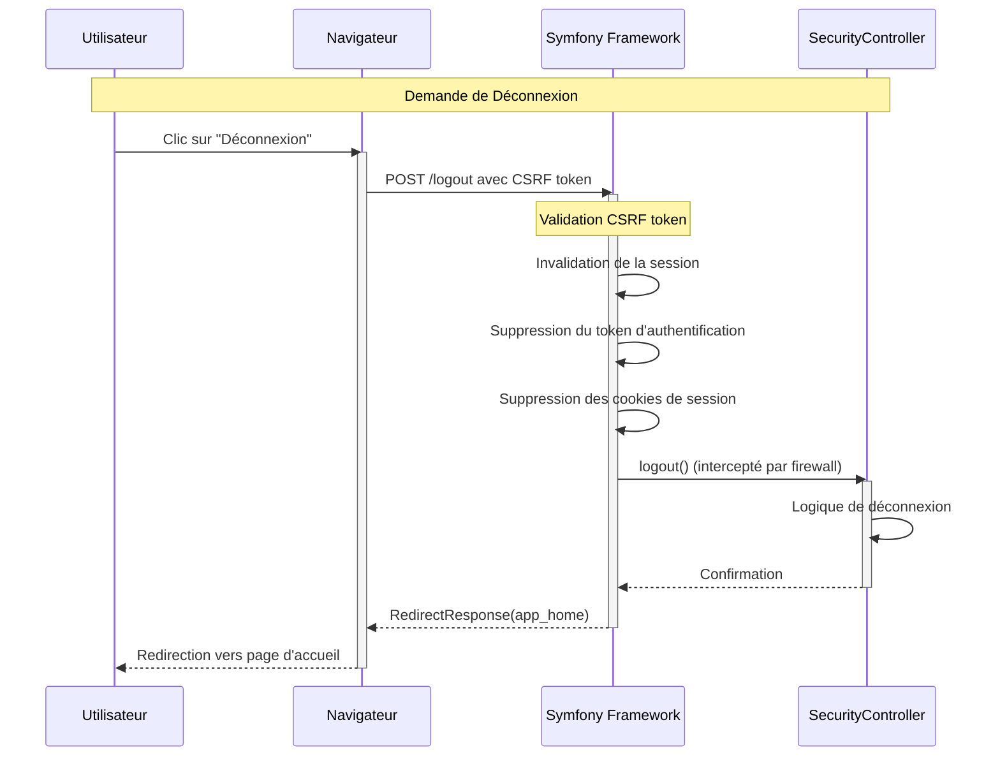

# 🎯 Diagrammes de Séquence Complets - Système d'Authentification EventHub

## 📋 Vue d'Ensemble

Ce document présente tous les diagrammes de séquence du système d'authentification EventHub, couvrant l'ensemble des processus d'authentification, d'inscription, de réinitialisation de mot de passe et de gestion des accès.

---

## 🔐 1. DIAGRAMME DE SÉQUENCE - CONNEXION UTILISATEUR

### Vue d'Ensemble
Le processus de connexion implique plusieurs composants : le navigateur, le SecurityController, l'AppAuthenticator, et la base de données.

### Séquence Détaillée

```mermaid
sequenceDiagram
    participant U as Utilisateur
    participant B as Navigateur
    participant SC as SecurityController
    participant S as Symfony Framework
    participant A as AppAuthenticator
    participant R as UserRepository
    participant DB as Base de Données

    Note over U,DB: PHASE 1: Affichage du Formulaire
    U->>B: Accès à /login
    B->>SC: GET /login
    activate SC
    
    alt Utilisateur déjà connecté
        SC->>SC: Vérification getUser()
        SC->>B: RedirectResponse(app_home)
        deactivate SC
        B-->>U: Redirection vers accueil
    else Utilisateur non connecté
        SC->>SC: Récupération erreurs précédentes
        SC->>B: render(login.html.twig)
        deactivate SC
        B-->>U: Affichage formulaire de connexion
    end

    Note over U,DB: PHASE 2: Soumission des Credentials
    U->>B: Saisit email + mot de passe
    B->>S: POST /login avec credentials
    activate S

    S->>A: authenticate(Request)
    activate A

    Note over A: Validation des données
    A->>A: Vérification email/password non vides
    A->>A: Validation CSRF token

    A->>R: findOneBy(['email' => email])
    activate R
    R->>DB: SELECT * FROM users WHERE email = ?
    DB-->>R: User entity ou null
    R-->>A: User object
    deactivate R

    Note over A: Création du Passport
    A->>A: new Passport(UserBadge, PasswordCredentials, CsrfTokenBadge)
    A-->>S: Passport object
    deactivate A

    Note over S: Vérification automatique du mot de passe
    S->>S: Vérification hash password
    S->>S: Validation CSRF token

    alt Authentification réussie
        S->>A: onAuthenticationSuccess()
        activate A
        
        A->>R: findOneByEmail() pour rôles réels
        activate R
        R->>DB: SELECT * FROM users WHERE email = ?
        DB-->>R: User avec rôles complets
        R-->>A: User object
        deactivate R
        
        Note over A: Logique de redirection par rôle
        A->>A: Analyse des rôles utilisateur
        
        alt ROLE_ADMIN + ROLE_ORGANISATEUR
            A->>S: RedirectResponse(common_dashboard)
        else ROLE_ADMIN uniquement
            A->>S: RedirectResponse(admin_dashboard)
        else ROLE_ORGANISATEUR uniquement
            A->>S: RedirectResponse(organisateur_dashboard)
        else ROLE_PARTICIPANT uniquement
            A->>S: RedirectResponse(participant_dashboard)
        else Rôle par défaut
            A->>S: RedirectResponse(calendar_index)
        end
        
        deactivate A
        
        S-->>B: Response avec redirection
        deactivate S
        
        B-->>U: Redirection vers dashboard approprié
        
    else Authentification échouée
        S->>S: BadCredentialsException
        S-->>B: Response avec erreur
        deactivate S
        
        B-->>U: Affichage message d'erreur
    end
```

### Composants Impliqués
- **SecurityController** : Gère l'affichage du formulaire et la logique de redirection
- **AppAuthenticator** : Valide les credentials et crée le Passport d'authentification
- **UserRepository** : Récupère les informations utilisateur depuis la base de données
- **Symfony Security** : Gère la vérification automatique du mot de passe et la création de la session

---

## 📝 2. DIAGRAMME DE SÉQUENCE - INSCRIPTION UTILISATEUR

### Vue d'Ensemble
Le processus d'inscription permet aux utilisateurs de créer un compte, avec support des invitations pré-remplies et attribution automatique des rôles.

### Séquence Détaillée

```mermaid
sequenceDiagram
    participant U as Utilisateur
    participant B as Navigateur
    participant RC as RegisterController
    participant UF as UserType Form
    participant UPH as UserPasswordHasher
    participant EM as EntityManager
    participant DB as Base de Données

    Note over U,DB: PHASE 1: Accès au Formulaire
    U->>B: Accès à /register
    B->>RC: GET /register
    activate RC
    
    alt Email pré-rempli (depuis invitation)
        RC->>RC: Récupération email et rôle depuis GET
        RC->>RC: Pré-remplissage du formulaire
    end
    
    RC->>RC: Création UserType form
    RC->>B: render(register.html.twig)
    deactivate RC
    B-->>U: Affichage formulaire d'inscription

    Note over U,DB: PHASE 2: Soumission du Formulaire
    U->>B: Remplit et soumet le formulaire
    B->>RC: POST /register avec données
    activate RC
    
    RC->>UF: handleRequest(Request)
    activate UF
    UF->>UF: Validation des données
    UF-->>RC: Form validé ou non
    deactivate UF
    
    alt Formulaire valide
        RC->>RC: Vérification email existant
        RC->>EM: findOneBy(['email' => email])
        activate EM
        EM->>DB: SELECT * FROM users WHERE email = ?
        DB-->>EM: Résultat de la recherche
        EM-->>RC: User existant ou null
        deactivate EM
        
        alt Email déjà utilisé
            RC->>RC: Ajout message d'erreur
            RC->>B: render avec erreur
            deactivate RC
            B-->>U: Affichage erreur
        else Email disponible
            RC->>UPH: hashPassword(user, plainPassword)
            activate UPH
            UPH->>UPH: Génération hash bcrypt
            UPH-->>RC: Mot de passe hashé
            deactivate UPH
            
            RC->>RC: Attribution des rôles
            alt Rôle depuis invitation
                RC->>RC: setRoles([prefilledRole])
            else Rôle par défaut
                RC->>RC: setRoles(['ROLE_PARTICIPANT'])
            end
            
            RC->>EM: persist(user)
            activate EM
            RC->>EM: flush()
            EM->>DB: INSERT INTO users
            DB-->>EM: Confirmation insertion
            EM-->>RC: Succès
            deactivate EM
            
            RC->>RC: Ajout message de succès
            RC->>B: RedirectResponse(app_login)
            deactivate RC
            B-->>U: Redirection vers connexion
        end
        
    else Formulaire invalide
        RC->>B: render avec erreurs de validation
        deactivate RC
        B-->>U: Affichage erreurs
    end
```

### Composants Impliqués
- **RegisterController** : Gère le processus d'inscription complet
- **UserType Form** : Valide les données du formulaire
- **UserPasswordHasher** : Hash le mot de passe de manière sécurisée
- **EntityManager** : Persiste l'utilisateur en base de données

---

## 🔑 3. DIAGRAMME DE SÉQUENCE - RÉINITIALISATION MOT DE PASSE

### Vue d'Ensemble
Le processus de réinitialisation implique l'envoi d'un email avec un token sécurisé et la validation de ce token pour changer le mot de passe.

### Séquence Détaillée

```mermaid
sequenceDiagram
    participant U as Utilisateur
    participant B as Navigateur
    participant RPC as ResetPasswordController
    participant RPH as ResetPasswordHelper
    participant M as Mailer
    participant EM as EntityManager
    participant DB as Base de Données

    Note over U,DB: PHASE 1: Demande de Réinitialisation
    U->>B: Accès à /reset-password
    B->>RPC: GET /reset-password
    activate RPC
    
    RPC->>RPC: Création ResetPasswordRequestFormType
    RPC->>B: render(request.html.twig)
    deactivate RPC
    B-->>U: Affichage formulaire de demande

    Note over U,DB: PHASE 2: Soumission de la Demande
    U->>B: Saisit email et soumet
    B->>RPC: POST /reset-password avec email
    activate RPC
    
    RPC->>RPC: Validation du formulaire
    alt Formulaire valide
        RPC->>EM: findOneBy(['email' => email])
        activate EM
        EM->>DB: SELECT * FROM users WHERE email = ?
        DB-->>EM: User ou null
        EM-->>RPC: User object
        deactivate EM
        
        alt Utilisateur trouvé
            RPC->>RPH: generateResetToken(user)
            activate RPH
            RPH->>RPH: Génération token sécurisé
            RPH-->>RPC: ResetToken object
            deactivate RPH
            
            RPC->>M: send(email)
            activate M
            M->>M: Envoi email avec template
            M-->>RPC: Confirmation envoi
            deactivate M
            
            RPC->>RPC: Stockage token en session
            RPC->>B: RedirectResponse(app_check_email)
            deactivate RPC
            B-->>U: Redirection vers confirmation
        else Utilisateur non trouvé
            RPC->>B: RedirectResponse(app_check_email)
            deactivate RPC
            B-->>U: Redirection vers confirmation
        end
        
    else Formulaire invalide
        RPC->>B: render avec erreurs
        deactivate RPC
        B-->>U: Affichage erreurs
    end

    Note over U,DB: PHASE 3: Réinitialisation du Mot de Passe
    U->>B: Clic sur lien dans email
    B->>RPC: GET /reset-password/reset/{token}
    activate RPC
    
    RPC->>RPC: Stockage token en session
    RPC->>B: RedirectResponse(app_reset_password)
    deactivate RPC
    B-->>U: Redirection vers formulaire
    
    U->>B: Accès au formulaire de réinitialisation
    B->>RPC: GET /reset-password
    activate RPC
    
    RPC->>RPC: Récupération token depuis session
    RPC->>RPH: validateTokenAndFetchUser(token)
    activate RPH
    RPH->>RPH: Validation du token
    RPH-->>RPC: User object
    deactivate RPH
    
    RPC->>RPC: Création ChangePasswordFormType
    RPC->>B: render(reset.html.twig)
    deactivate RPC
    B-->>U: Affichage formulaire de changement
    
    U->>B: Saisit nouveau mot de passe
    B->>RPC: POST /reset-password avec nouveau mot de passe
    activate RPC
    
    RPC->>RPC: Validation du formulaire
    alt Formulaire valide
        RPC->>RPH: removeResetRequest(token)
        activate RPH
        RPH->>RPH: Suppression du token
        RPH-->>RPC: Confirmation
        deactivate RPH
        
        RPC->>UPH: hashPassword(user, plainPassword)
        activate UPH
        UPH->>UPH: Génération nouveau hash
        UPH-->>RPC: Mot de passe hashé
        deactivate UPH
        
        RC->>EM: flush()
        activate EM
        EM->>DB: UPDATE users SET password = ?
        DB-->>EM: Confirmation mise à jour
        EM-->>RC: Succès
        deactivate EM
        
        RPC->>RPC: Nettoyage de la session
        RPC->>B: RedirectResponse(app_home)
        deactivate RPC
        B-->>U: Redirection vers accueil
    else Formulaire invalide
        RPC->>B: render avec erreurs
        deactivate RPC
        B-->>U: Affichage erreurs
    end
```

### Composants Impliqués
- **ResetPasswordController** : Orchestre le processus de réinitialisation
- **ResetPasswordHelper** : Gère la génération et validation des tokens
- **Mailer** : Envoie les emails de réinitialisation
- **EntityManager** : Met à jour le mot de passe en base

---

## 🚫 4. DIAGRAMME DE SÉQUENCE - GESTION DES ACCÈS REFUSÉS

### Vue d'Ensemble
Le AccessDeniedHandler gère intelligemment les tentatives d'accès non autorisées en redirigeant vers des pages appropriées selon le contexte.

### Séquence Détaillée



### Composants Impliqués
- **AccessDeniedHandler** : Analyse le type d'erreur et détermine la redirection appropriée
- **Router** : Génère les URLs de redirection
- **Symfony Security** : Détecte les violations d'accès

---

## 🔒 5. DIAGRAMME DE SÉQUENCE - DÉCONNEXION UTILISATEUR

### Vue d'Ensemble
Le processus de déconnexion invalide la session et redirige l'utilisateur vers la page d'accueil.

### Séquence Détaillée



### Composants Impliqués
- **Symfony Security** : Gère l'invalidation de la session
- **SecurityController** : Traite la logique de déconnexion
- **Firewall** : Intercepte la route de déconnexion

---

## 🎯 6. DIAGRAMME DE SÉQUENCE - REDIRECTION APRÈS CONNEXION

### Vue d'Ensemble
Le SecurityController gère la redirection intelligente des utilisateurs selon leurs rôles après une connexion réussie.

### Séquence Détaillée

```mermaid
sequenceDiagram
    participant U as Utilisateur
    participant B as Navigateur
    participant SC as SecurityController
    participant S as Symfony Framework

    Note over U,S: Accès à la Route de Redirection
    U->>B: Accès à /redirect
    activate B
    B->>SC: GET /redirect
    activate SC
    
    SC->>S: getUser()
    activate S
    S-->>SC: User object ou null
    deactivate S
    
    alt Utilisateur non connecté
        SC->>SC: Ajout message d'avertissement
        SC->>B: RedirectResponse(app_login)
        deactivate SC
        B-->>U: Redirection vers connexion
    else Utilisateur connecté
        SC->>SC: Analyse des rôles utilisateur
        
        alt ROLE_ADMIN + ROLE_ORGANISATEUR
            SC->>B: RedirectResponse(common_dashboard)
        else ROLE_ADMIN uniquement
            SC->>B: RedirectResponse(admin_dashboard)
        else ROLE_ORGANISATEUR uniquement
            SC->>B: RedirectResponse(organisateur_dashboard)
        else ROLE_PARTICIPANT uniquement
            SC->>B: RedirectResponse(participant_dashboard)
        else Rôle par défaut
            SC->>B: RedirectResponse(app_home)
        end
        
        deactivate SC
        B-->>U: Redirection vers dashboard approprié
    end
```

### Composants Impliqués
- **SecurityController** : Analyse les rôles et détermine la redirection
- **Symfony Security** : Fournit les informations utilisateur

---

## 🏗️ ARCHITECTURE GÉNÉRALE DU SYSTÈME

### Hiérarchie des Rôles
```
ROLE_USER (base)
    ↓
ROLE_PARTICIPANT
    ↓
ROLE_ORGANISATEUR
    ↓
ROLE_ADMIN
```

### Composants de Sécurité
- **AppAuthenticator** : Gestionnaire d'authentification personnalisé
- **AccessDeniedHandler** : Gestionnaire des accès refusés
- **SecurityController** : Contrôleur principal de sécurité
- **RegisterController** : Gestion de l'inscription
- **ResetPasswordController** : Gestion de la réinitialisation de mot de passe

### Configuration de Sécurité
```yaml
# Firewall principal
main:
    lazy: true
    provider: user_provider
    entry_point: App\Security\AppAuthenticator
    custom_authenticator: App\Security\AppAuthenticator
    access_denied_handler: App\Security\AccessDeniedHandler
    logout:
        path: /logout
        target: app_home
        csrf_parameter: '_csrf_token'
        csrf_token_id: 'logout'
        invalidate_session: true

# Contrôle d'accès
access_control:
    - { path: ^/login$, roles: PUBLIC_ACCESS }
    - { path: ^/register, roles: PUBLIC_ACCESS }
    - { path: ^/reset-password, roles: PUBLIC_ACCESS }
    - { path: ^/admin, roles: ROLE_ADMIN }
    - { path: ^/organizer, roles: ROLE_ORGANISATEUR }
    - { path: ^/participant, roles: ROLE_PARTICIPANT }
    - { path: ^/, roles: IS_AUTHENTICATED_FULLY }
```

---

## 🔍 POINTS CLÉS ET BONNES PRATIQUES

### 1. **Sécurité CSRF**
- Protection sur toutes les actions sensibles
- Tokens uniques pour chaque formulaire
- Validation automatique par Symfony

### 2. **Gestion des Sessions**
- Sessions sécurisées avec cookies HttpOnly
- Invalidation automatique à la déconnexion
- Gestion des timeouts

### 3. **Validation des Données**
- Validation côté serveur obligatoire
- Sanitisation des entrées utilisateur
- Messages d'erreur informatifs

### 4. **Gestion des Erreurs**
- Redirections appropriées selon le contexte
- Messages d'erreur clairs pour l'utilisateur
- Logs détaillés pour le débogage

### 5. **Performance**
- Requêtes optimisées en base de données
- Cache des informations utilisateur
- Sessions légères

---

## 📊 MÉTRIQUES ET MONITORING

### Logs d'Authentification
```php
// Dans AppAuthenticator
error_log("Authentication attempt - Email: " . $email);
error_log("User found - ID: " . $user->getId());
error_log("User password hash: " . $user->getPassword());
```

### Vérification des Rôles
```php
// Vérification des rôles réels
$userFromDb = $this->userRepository->findOneByEmail($user->getUserIdentifier());
$realRoles = $userFromDb ? $userFromDb->getRoles() : $user->getRoles();
```

### Test des Permissions
```bash
# Vérifier la configuration de sécurité
php bin/console debug:security

# Vérifier les routes et leurs permissions
php bin/console debug:router
```

---

## 🚀 AMÉLIORATIONS FUTURES

### 1. **Authentification Multi-Facteurs**
- SMS, Email, Authentification par application
- Gestion des sessions multiples
- Détection d'activité suspecte

### 2. **Intégration OAuth/SSO**
- Connexion via Google, Microsoft, etc.
- Fédération d'identités
- Single Sign-On

### 3. **Audit et Monitoring Avancé**
- Logs détaillés des tentatives de connexion
- Alertes en cas d'activité suspecte
- Statistiques d'utilisation détaillées

### 4. **Gestion des Sessions Avancée**
- Sessions concurrentes limitées
- Expiration automatique basée sur l'activité
- Synchronisation multi-appareils

---

*Ce document présente l'architecture complète du système d'authentification EventHub, montrant tous les processus et interactions entre les composants de sécurité.*
