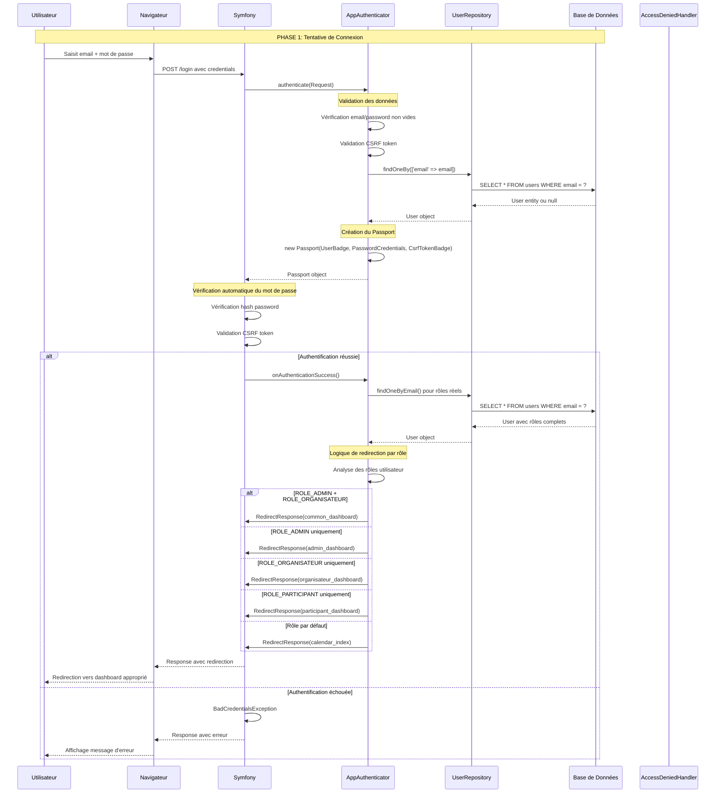
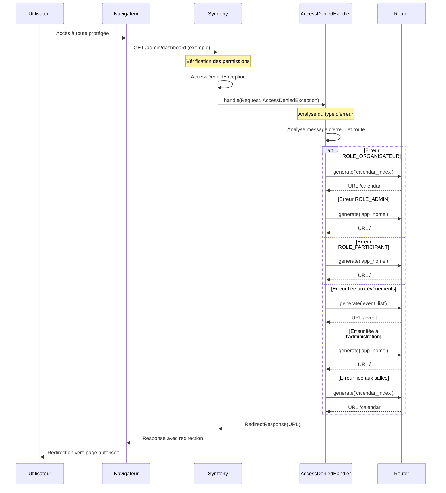
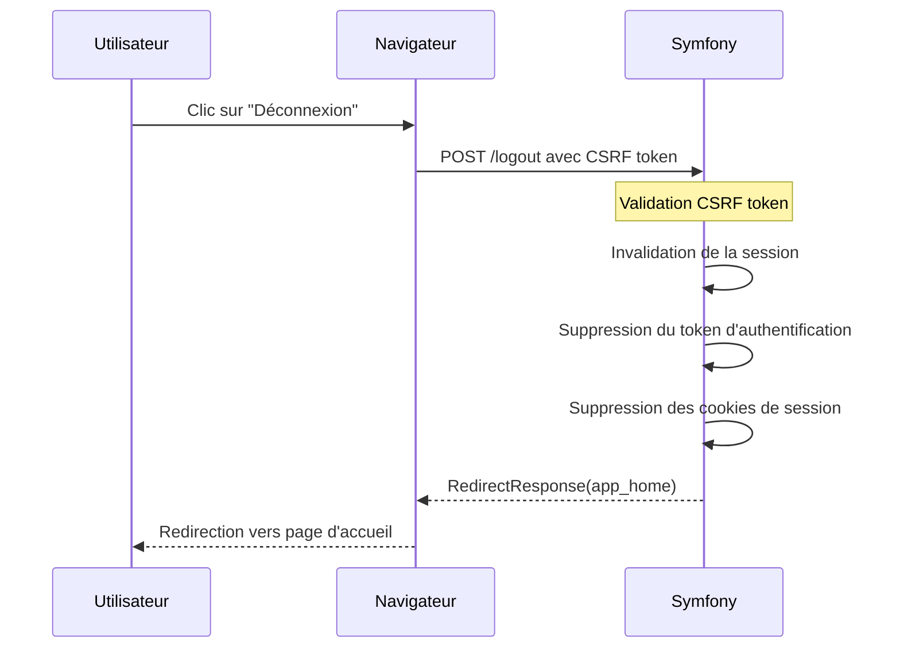

# Diagramme de Séquence d'Authentification - EventHub

## 🎯 Vue d'Ensemble du Système d'Authentification

Le système EventHub utilise une architecture d'authentification basée sur Symfony Security avec une hiérarchie de rôles et un système de redirection intelligent.

## 🔐 Architecture de Sécurité

### Hiérarchie des Rôles
```
ROLE_USER (base)
    ↓
ROLE_PARTICIPANT
    ↓
ROLE_ORGANISATEUR
    ↓
ROLE_ADMIN
```

### Composants de Sécurité
- **AppAuthenticator** : Gestionnaire d'authentification personnalisé
- **AccessDeniedHandler** : Gestionnaire des accès refusés
- **UserRepository** : Fournisseur d'utilisateurs
- **Firewall** : Configuration des zones de sécurité

## 📋 Diagramme de Séquence d'Authentification



## 🚫 Gestion des Accès Refusés



## 🔒 Configuration de Sécurité

### Firewall Principal
```yaml
main:
    lazy: true
    provider: user_provider
    entry_point: App\Security\AppAuthenticator
    custom_authenticator: App\Security\AppAuthenticator
    access_denied_handler: App\Security\AccessDeniedHandler
    logout:
        path: /logout
        target: app_home
        csrf_parameter: '_csrf_token'
        csrf_token_id: 'logout'
        invalidate_session: true
```

### Contrôle d'Accès
```yaml
access_control:
    # Routes publiques
    - { path: ^/login$, roles: PUBLIC_ACCESS }
    - { path: ^/register, roles: PUBLIC_ACCESS }
    - { path: ^/reset-password, roles: PUBLIC_ACCESS }
    - { path: ^/invitation, roles: PUBLIC_ACCESS }
    - { path: ^/$, roles: PUBLIC_ACCESS }
    
    # Routes protégées par rôle
    - { path: ^/admin, roles: ROLE_ADMIN }
    - { path: ^/organizer, roles: ROLE_ORGANISATEUR }
    - { path: ^/participant, roles: ROLE_PARTICIPANT }
    
    # Règle générale (en dernier)
    - { path: ^/, roles: IS_AUTHENTICATED_FULLY }
```

## 🔄 Flux de Déconnexion



## 🛡️ Protection CSRF

### Tokens CSRF Utilisés
- **authenticate** : Pour la connexion
- **logout** : Pour la déconnexion
- **submit** : Pour les formulaires généraux

### Configuration
```yaml
framework:
    csrf_protection:
        stateless_token_ids:
            - submit
            - authenticate
            - logout
```

## 📊 Gestion des Sessions

### Configuration des Sessions
```yaml
framework:
    session:
        handler_id: 'session.handler.native_file'
        save_path: '%kernel.project_dir%/var/sessions/%kernel.environment%'
        cookie_secure: auto
        cookie_httponly: true
        cookie_samesite: 'lax'
        cookie_lifetime: 3600
        enabled: true
```

### Cycle de Vie de la Session
1. **Création** : Au moment de la connexion
2. **Validation** : À chaque requête
3. **Renouvellement** : À chaque activité
4. **Destruction** : À la déconnexion ou expiration

## 🎯 Points Clés du Système

### 1. **Authentification Centralisée**
- Un seul point d'entrée via `AppAuthenticator`
- Validation automatique des credentials
- Gestion intelligente des erreurs

### 2. **Redirection Intelligente**
- Redirection basée sur les rôles réels de l'utilisateur
- Prise en compte de la hiérarchie des rôles
- Gestion des cas particuliers (utilisateurs multi-rôles)

### 3. **Sécurité Renforcée**
- Protection CSRF sur toutes les actions sensibles
- Validation des tokens à chaque étape
- Gestion des sessions sécurisées

### 4. **Gestion d'Erreurs Robuste**
- `AccessDeniedHandler` personnalisé
- Redirections appropriées selon le contexte
- Messages d'erreur informatifs

## 🔍 Dépannage et Debug

### Logs d'Authentification
```php
// Dans AppAuthenticator
error_log("Authentication attempt - Email: " . $email);
error_log("User found - ID: " . $user->getId());
error_log("User password hash: " . $user->getPassword());
```

### Vérification des Rôles
```php
// Vérification des rôles réels
$userFromDb = $this->userRepository->findOneByEmail($user->getUserIdentifier());
$realRoles = $userFromDb ? $userFromDb->getRoles() : $user->getRoles();
```

### Test des Permissions
```bash
# Vérifier la configuration de sécurité
php bin/console debug:security

# Vérifier les routes et leurs permissions
php bin/console debug:router
```

## 📈 Améliorations Possibles

### 1. **Authentification Multi-Facteurs**
- SMS, Email, Authentification par application
- Gestion des sessions multiples

### 2. **Gestion des Sessions Avancée**
- Sessions concurrentes limitées
- Détection d'activité suspecte
- Expiration automatique

### 3. **Audit et Monitoring**
- Logs détaillés des tentatives de connexion
- Alertes en cas d'activité suspecte
- Statistiques d'utilisation

### 4. **Intégration OAuth/SSO**
- Connexion via Google, Microsoft, etc.
- Fédération d'identités
- Single Sign-On

---

*Ce diagramme représente l'architecture d'authentification complète du système EventHub, montrant les interactions entre les différents composants et le flux de sécurité.*

